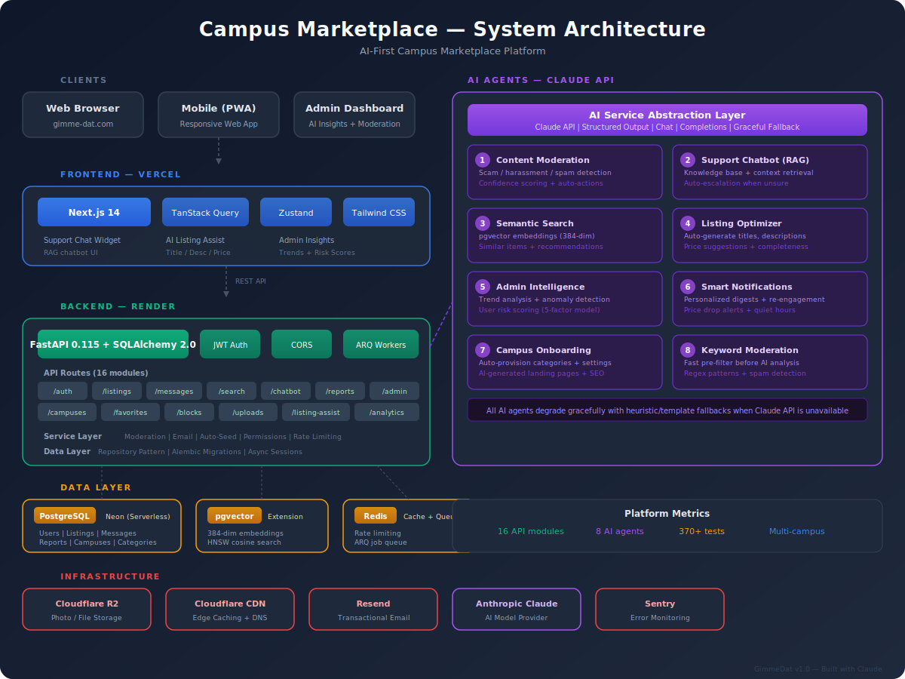

<div align="center">

# Campus Marketplace (GimmeDat)

**AI-first campus marketplace for college students to discover services and buy/sell items.**

Built with FastAPI + Next.js 14 + Claude AI | Multi-campus | Messaging-only (no payments)

[](https://gimme-dat.com)
[](https://gettysburg-marketplace.onrender.com/health)
[](#running-tests)

</div>

---

## Architecture

<p align="center">
  
</p>

## Features

### Core Platform

- **Multi-campus isolation** — each university gets its own community with `.edu` email verification
- **Listings** — post services (tutoring, photography, rides) or items (textbooks, electronics, furniture)
- **Messaging** — direct conversations between buyers and sellers, threaded by listing
- **Search** — full-text PostgreSQL search + AI-powered semantic search
- **Favorites** — save listings, get price drop alerts
- **Reports & moderation** — community reporting with admin moderation queue
- **User blocking** — block users from contacting you
- **Photo uploads** — up to 6 photos per listing via S3-compatible storage
- **Ads system** — featured carousel with analytics and CSV export
- **Categories** — 13 default categories, customizable per campus
- **Feedback** — user feedback collection with admin dashboard
- **Applications** — team recruiting and application system

### 8 AI Agents (Claude-powered)

All AI agents are built on a unified abstraction layer and **degrade gracefully** with template/heuristic fallbacks when the Claude API is unavailable.

| # | Agent | What It Does |
|---|-------|-------------|
| 1 | **Content Moderation** | Two-pass system: keyword pre-filter + LLM analysis. Detects scam, harassment, spam, prohibited content. Returns confidence scores and auto-actions (allow/flag/block). |
| 2 | **Support Chatbot (RAG)** | Retrieval-augmented chatbot that answers user questions using an 18-article knowledge base (terms, privacy, how-it-works, safety). Auto-escalates to admin when confidence is low. |
| 3 | **Semantic Search** | pgvector embeddings (384-dim) with HNSW indexing. Semantic search, similar-listing suggestions, and personalized recommendations based on user favorites. |
| 4 | **Listing Optimizer** | AI-assisted listing creation: auto-generate descriptions from keywords, suggest titles, recommend student-friendly pricing, detect categories, and score listing completeness (0-100). |
| 5 | **Admin Intelligence** | Analytics dashboard with trend analysis (30-day), anomaly detection (z-score), user risk scoring (5-factor model: reports, flags, age, removals, suspensions), and weekly summaries. |
| 6 | **Smart Notifications** | Personalized daily/weekly digests, re-engagement campaigns for inactive users, listing expiry nudges, price drop alerts for favorited items, quiet hours, and engagement scoring. |
| 7 | **Campus Onboarding** | Self-service campus provisioning with auto-generated categories, AI-generated landing page content and SEO metadata, cross-campus analytics comparison. |
| 8 | **Keyword Moderation** | Fast pre-filter using regex patterns, banned keyword lists, and spam detection (phone numbers, emails, payment keywords). Runs before AI moderation for cost efficiency. |

### Frontend AI Components

- **Support Chat Widget** — floating chat panel with quick actions, source citations, typing indicator, emergency contacts, and escalation indicators
- **AI Listing Assist Panel** — inline "Generate with AI" buttons on the listing creation form for title, description, price, category, and completeness scoring
- **Admin Insights Dashboard** — trends visualization, anomaly alerts with severity, user risk scores with expandable factor breakdowns

## Tech Stack

| Layer | Technology | Production |
|-------|-----------|-----------|
| **Backend** | FastAPI 0.115, SQLAlchemy 2.0 (async), Python 3.11+ | Render |
| **Frontend** | Next.js 14 (App Router), TypeScript 5.7, Tailwind CSS | Vercel |
| **Database** | PostgreSQL 16 + pgvector extension | Neon (Serverless) |
| **Cache/Queue** | Redis 7, ARQ workers | Render |
| **Storage** | S3-compatible (MinIO local, Cloudflare R2 prod) | Cloudflare R2 |
| **AI** | Anthropic Claude API (claude-sonnet-4-20250514) | Anthropic |
| **Email** | Console (dev), Resend (prod) | Resend |
| **CDN** | Cloudflare | Cloudflare |
| **Auth** | JWT access + refresh token rotation (30-day sessions) | — |
| **Monitoring** | Sentry (optional) | Sentry |

## Project Structure

```
campus-marketplace/
├── bulletin-board-api/          # FastAPI backend
│   ├── app/
│   │   ├── api/v1/             # 16 route modules
│   │   ├── models/             # SQLAlchemy ORM models
│   │   ├── services/           # Business logic + 8 AI agents
│   │   ├── repositories/       # Data access layer
│   │   ├── workers/            # ARQ background jobs
│   │   └── core/               # Security, permissions, rate limiting
│   ├── alembic/                # Database migrations
│   ├── schemas/                # Pydantic request/response schemas
│   ├── scripts/                # Seed data, admin creation
│   └── tests/                  # 370+ unit & integration tests
│
├── bulletin-board-frontend/     # Next.js frontend
│   ├── src/app/                # App Router pages
│   ├── src/components/         # React components (chat, listings, admin)
│   ├── src/lib/                # Hooks, stores, API clients, types
│   └── e2e/                    # Playwright E2E tests
│
├── ai-automation/               # Autonomous AI agent harness
│   ├── tasks.json              # Structured task list
│   ├── run-dev-loop.sh         # Claude Code automation loop
│   └── claude-progress.md      # Session progress log
│
├── docs/                        # Documentation & diagrams
└── docker-compose.yml           # Local development orchestration
```

## Quick Start

### Docker (full stack)

```bash
# 1. Copy env file
cp .env.example bulletin-board-api/.env

# 2. Start everything
docker compose up -d

# 3. Run migrations
docker compose exec api alembic upgrade head

# 4. Seed categories
docker compose exec api python -m scripts.seed_data

# Visit http://localhost:3000
```

### Local Development

**Prerequisites:** Python 3.11+, Node.js 18+, PostgreSQL 16, Redis 7

```bash
# Start infrastructure only
docker compose up -d db redis minio mailhog

# ── Backend ──
cd bulletin-board-api
python -m venv venv
source venv/bin/activate        # Linux/Mac
venv\Scripts\activate           # Windows
pip install -r requirements.txt
cp ../.env.example .env
alembic upgrade head
python -m scripts.seed_data
uvicorn app.main:app --reload --port 8000

# ── Frontend (new terminal) ──
cd bulletin-board-frontend
npm install
npm run dev
```

## API Endpoints

| Module | Prefix | Description |
|--------|--------|-------------|
| Auth | `/api/v1/auth` | Login, register, refresh, verify email, password reset |
| Users | `/api/v1/users` | Profile, settings, notification preferences |
| Campuses | `/api/v1/campuses` | List active campuses, campus details |
| Listings | `/api/v1/listings` | CRUD, expiry, photos, view tracking |
| Messages | `/api/v1/messages` | Threads, send/receive, read receipts |
| Favorites | `/api/v1/favorites` | Save/unsave listings |
| Reports | `/api/v1/reports` | Report content, auto-triage via AI |
| Blocks | `/api/v1/blocks` | Block/unblock users |
| Uploads | `/api/v1/uploads` | Presigned upload URLs, file management |
| Search | `/api/v1/search` | Semantic search, similar listings, recommendations |
| Chatbot | `/api/v1/chatbot` | RAG-powered support chat |
| Listing Assist | `/api/v1/listing-assist` | AI suggestions (title, desc, price, category) |
| Admin | `/api/v1/admin` | User management, moderation queue, keywords |
| Admin Analytics | `/api/v1/admin/analytics` | Trends, anomalies, risk scores, summaries |
| Campus Onboarding | `/api/v1/admin/campuses` | Provision new campuses, cross-campus analytics |
| Categories | `/api/v1/categories` | Category management |
| Ads | `/api/v1/ads` | Featured listings, analytics, CSV export |
| Feedback | `/api/v1/feedback` | User feedback collection |
| Applications | `/api/v1/applications` | Team recruiting system |

## Environment Variables

| Variable | Description | Required |
|----------|-------------|----------|
| `DATABASE_URL` | PostgreSQL connection string (asyncpg) | Yes |
| `APP_SECRET_KEY` | Application secret (min 32 chars) | Yes |
| `JWT_SECRET_KEY` | JWT signing key (min 32 chars) | Yes |
| `FRONTEND_URL` | Frontend origin(s), comma-separated | Yes |
| `REDIS_URL` | Redis connection string | Yes |
| `ANTHROPIC_API_KEY` | Claude API key (AI features) | No |
| `S3_ENDPOINT_URL` | S3-compatible storage endpoint | No |
| `S3_ACCESS_KEY_ID` | S3 access key | No |
| `S3_SECRET_ACCESS_KEY` | S3 secret key | No |
| `CDN_URL` | Public CDN URL for uploaded files | No |
| `RESEND_API_KEY` | Resend email API key | No |
| `SENTRY_DSN` | Sentry error tracking DSN | No |

See `.env.example` for the full list with defaults.

## Running Tests

```bash
# Backend (370+ tests)
cd bulletin-board-api
pytest

# With coverage
pytest --cov=app --cov-report=term-missing

# Frontend
cd bulletin-board-frontend
npm test

# E2E (requires running dev server)
npm run test:e2e
```

## Local Dev URLs

| Service | URL |
|---------|-----|
| Frontend | http://localhost:3000 |
| API Docs (Swagger) | http://localhost:8000/docs |
| API Docs (ReDoc) | http://localhost:8000/redoc |
| MailHog | http://localhost:8025 |
| MinIO Console | http://localhost:9001 |

## AI Agent Development Harness

The `ai-automation/` directory contains an autonomous development harness built on [Anthropic's patterns for long-running agents](https://docs.anthropic.com/en/docs/build-with-claude/long-running-agents):

- **`tasks.json`** — structured task list with dependencies, status tracking, and estimated files
- **`run-dev-loop.sh`** — shell script that loops Claude Code N times with auto-permissions, logging, and a fixed prompt for autonomous task execution
- **`init.sh`** — environment health checker (13 checks across directory structure, git, Python, Node)
- **`claude-progress.md`** — session-by-session progress log

All 8 AI agents were built autonomously using this harness across 8 sessions.

## License

Private repository. All rights reserved.
